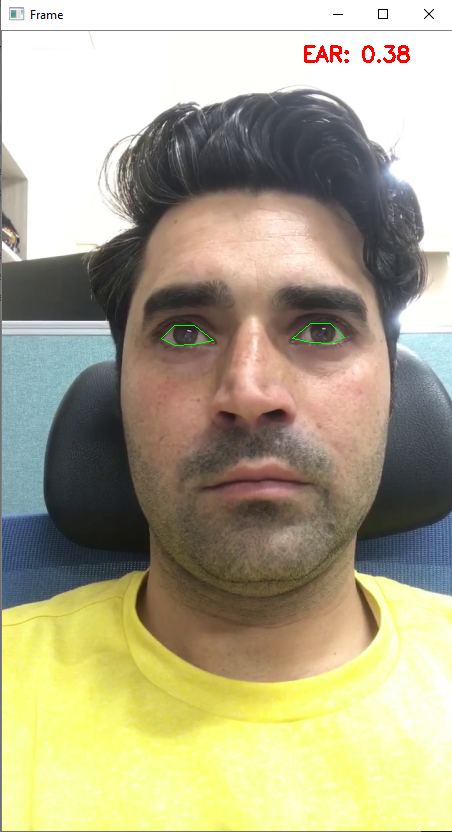
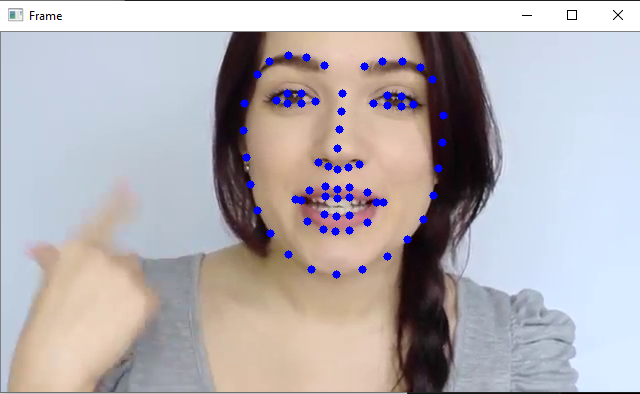

# FaceLandMarkDetection-and-Drowsiness-Detection-base-Alarm-Generation
Python project for FaceLandMarkDetection and Drowsiness Detection base Alarm Generation
### Download .dat file
Download shape_predictor_68_face_landmarks.dat from here https://github.com/AKSHAYUBHAT/TensorFace/tree/master/openface/models/dlib
### Command to run drowsiness.py file
Command for runing the Drowsiness.py Python drowsiness.py --shape-predictor shape_predictor_68_face_landmarks.dat --alarm alarm2.mp3 --video video1.mp4
### Out put results 

